# 🏠 HBNB - Part 4: Simple Web Client

Bienvenue dans la quatrième partie du projet **HBNB** !  
Ici, nous construisons un client web interactif pour communiquer avec notre API Flask existante.

---

## 📋 Objectifs

- Développer une interface utilisateur moderne en **HTML5**, **CSS3**, et **JavaScript ES6**.
- Interagir avec l'API back-end à l'aide de **Fetch API**.
- Implémenter la gestion de l'authentification utilisateur (JWT en cookie).
- Dynamiser la navigation sans rechargement de page.

---

## 🏗️ Fonctionnalités Implémentées

### 🔑 Login
- Formulaire de connexion (email + mot de passe).
- Authentification via appel API (`/login`).
- Stockage sécurisé du **JWT** dans un **cookie**.
- Redirection automatique après connexion réussie.
- Message d’erreur en cas d’échec.

### 🗺️ Liste des Lieux
- Récupération de la liste de lieux via API.
- Affichage sous forme de cartes (`place-card`) avec nom, prix par nuit, bouton "View Details".
- Filtrage dynamique côté client par **prix** (10€, 50€, 100€, Tous).
- Affichage conditionnel du lien de connexion selon l'authentification.

### 🏡 Détail d'un Lieu
- Vue détaillée d’un lieu spécifique :
  - Nom, description, hôte, prix, équipements, avis.
- Chargement dynamique selon l’ID de lieu extrait de l’URL.
- Section pour ajouter un avis, affichée uniquement pour les utilisateurs connectés.

### 📝 Ajouter un Avis
- Formulaire pour soumettre un avis (texte + note).
- Accessible uniquement pour les utilisateurs authentifiés.
- Appel API POST pour envoyer le nouvel avis.
- Message de succès ou d’échec affiché à l’utilisateur.

---

## 📂 Structure des Pages

- `index.html` : Liste des lieux
- `login.html` : Formulaire de connexion
- `place.html` : Détail d'un lieu
- `add_review.html` : Formulaire pour ajouter un avis

---

## 🧩 Technologies Utilisées

- **HTML5** - Structure sémantique
- **CSS3** - Mise en forme responsive
- **JavaScript (ES6)** - Dynamisation du contenu (Fetch API, DOM Manipulation)
- **Cookies** - Gestion de session
- **Fetch API** - Requêtes HTTP asynchrones
- **JWT** - Authentification sécurisée

---

## ⚙️ Comment Démarrer

1. **Cloner ce repository** :
   ```bash
   git clone https://github.com/HamzaMoinet/holbertonschool-hbnb.git
   cd holbertonschool-hbnb/part4


## 🌳 Arborescence du Projet

```mermaid
graph TD
    A[Part 4 - HBNB Project] --> B[Front/]
    B --> B1[index.html]
    B --> B2[login.html]
    B --> B3[place.html]
    B --> B4[add_review.html]
    B --> B5[scripts.js]
    B --> B6[styles.css]
    B --> B7[images/]
    B7 --> B7a[logo.png]
    B7 --> B7b[background.jpg]
    
    A --> C[Back/]
    C --> C1[.gitignore]
    C --> C2[config.py]
    C --> C3[database_diagram.md]
    C --> C4[requirements.txt]
    C --> C5[run.py]
    C --> C6[app/]
    C6 --> C6a[__init__.py]
    C6 --> C6b[api/]
    C6 --> C6c[models/]
    C6 --> C6d[persistence/]
    C6 --> C6e[services/]
    C --> C7[instance/]
    C7 --> C7a[development.db]
    C --> C8[tests/]
    C8 --> C8a[test_amenity.py]
    C8 --> C8b[test_BaseModel.py]
    C8 --> C8c[test_facade.py]
    C8 --> C8d[test_operations.sql]
    C8 --> C8e[test_place.py]
    C8 --> C8f[test_review.py]
    C8 --> C8g[test_user.py]
    C8 --> C8h[TestAmenitiesAPI.py]

    A --> D[README.md]
```

